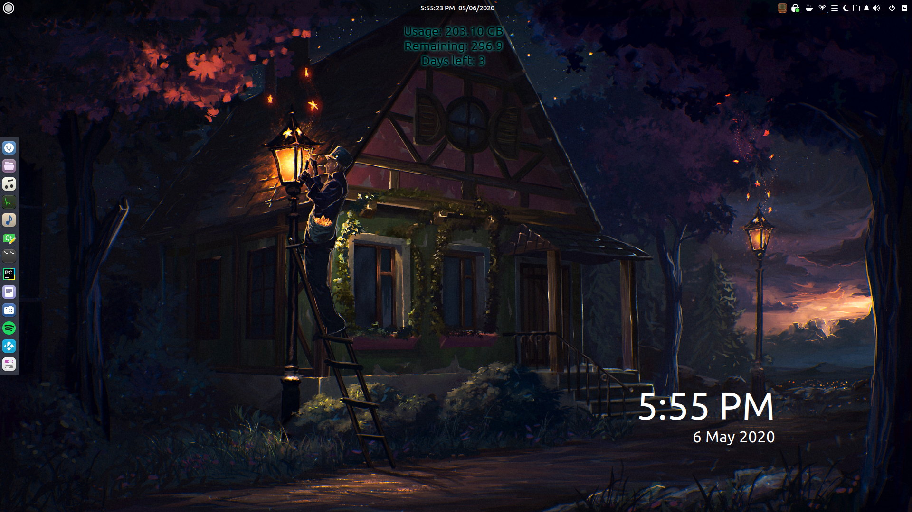
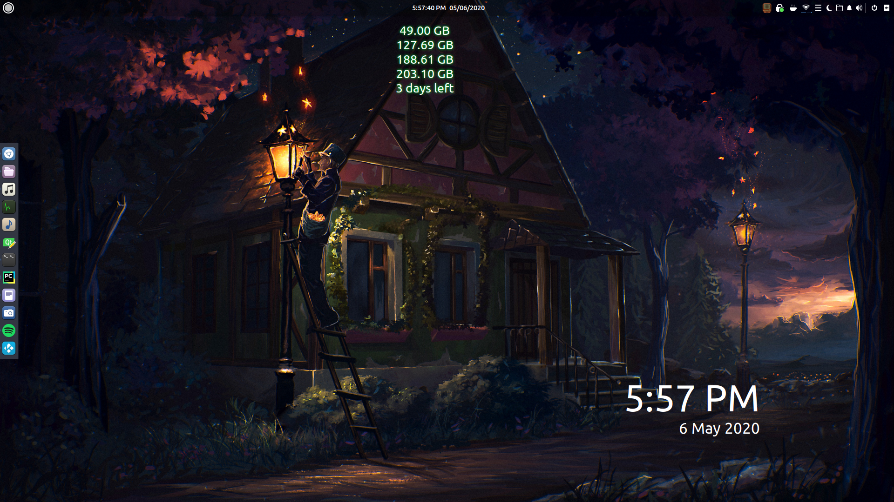
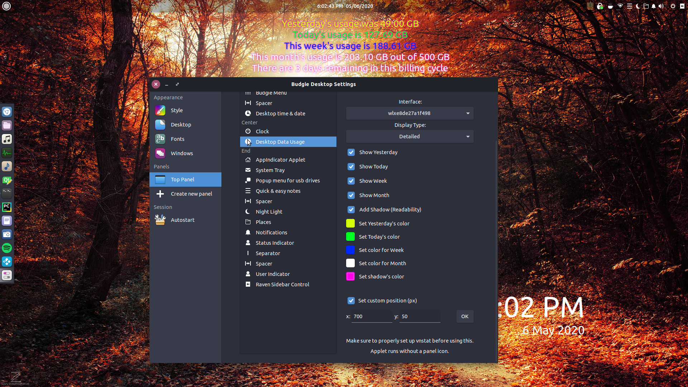

# Budgie-ShowData
*NOTE as a personal project, this is still unfinished, vnstat config isn't editable through in settings, yet!*  
[Update]  
Changes to some math problems with converting data types.  
Datacap is no longer hardcoded, settings ui updated to reflect changes.  
[/Updates]  
A data usage display based on vnstats and Budgie-ShowTime.  
In order to use the applet, first install vnstat:  
`sudo apt-get update`  
`sudo apt-get install vnstat`  
`vnstat --iflist`  
Example output: `Available interfaces: tun0 (10 Mbit) lo wlxe8de27a1f498 enp4s0`  
Do not add the "(10 MBit)" part into the next command.  
`vnstat --create -i tun0` or `vnstat --create -i wlxe8de27a1f498`  
`sudo systemctl enable vnstat.service`  
`sudo systemctl start vnstat.service`  
After everything is setup, download ShowData, and copy to:  
`/usr/lib/budgie-desktop/plugins`  
And run:
`budgie-panel --replace &` for any debugging purposes.  
* (Cannot close terminal without killing the panel)  
Or run:
`nohup budgie-panel --replace&`
Which will allow you to close the terminal and keep the panel.
  
This applet will create an ini: `/home/USER/.config/budgie-extras/showdata`  
And a config file for vnstats: `/home/USER/.vnstatrc`  
  
  
* Note - To delete DB file for interface, use:  
`vnstat --delete -i eth0`  

Examples:  
Option: Minimal With Shadow Effects  
  
  
Option: Short With Everything Displayed  
  
  
Option: Long With Everything Displayed  
  
  
Option: Detailed With Everything Displayed  
 
  
Option: Detailed With Shadow Effects 
 
  
Options Menu  

